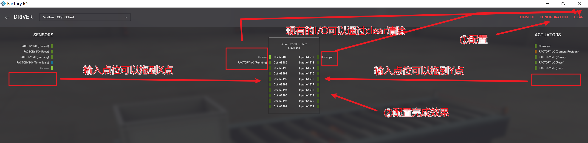
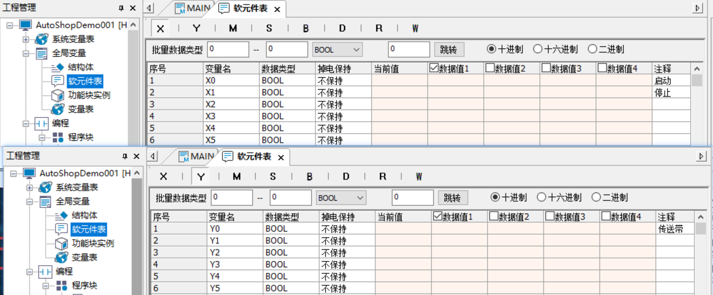
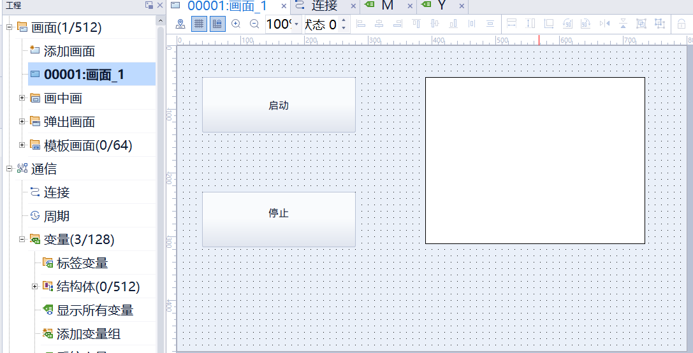
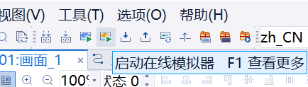

# 汇川H5U系列PLC梯形图+3D仿真+触摸屏

## 仿真软件
+ AutoShop V4.10.2.4 Setup
+ factoryio-2.5.5-installer
+ InoTouchPad Setup-V1R6C00SPC82025111004.exe

## AutoShop+FactoryIO
+ 在AutoShop里面编好梯形图程序，打开自带的仿真
+ 进入factoryIO里面，然后找到一个场景进入，添加所需要的元件
+ 在factoryIO左下角的Driver选中`Modbus TCP/IP Client`，在右上角`CONFIGURATION`进入配置

> 配置详情

### 一、核心参数定义
> 连接PLC

|配置内容|配置参数|含义|
|-|-|-|
|Host|127.0.0.1|PLC的IP地址，仿真的话就在本地|

> 在汇川H5U系列PLC的Modbus TCP Client配置中，**offset**（偏移量）和**count**（数量）定义了与Server侧数字量点位的映射关系，具体对应关系如下：

| 参数 | 含义 | 配置参数 | 对应PLC实际I/O点 |
|------|------|----------|-----------------|
| **Digital Inputs offset** | 数字输入点的**起始Modbus地址** | 63488 | 对应H5U的**X0**输入点（X0~X9） |
| **Digital Inputs count** | 要读取的数字输入点**数量** | 10 | 读取从offset开始的10个连续输入点 |
| **Digital Outputs offset** | 数字输出点的**起始Modbus地址** | 64512 | 对应H5U的**Y0**输出点（Y0~Y9） |
| **Digital Outputs count** | 要读写的数字输出点**数量** | 10 | 读写从offset开始的10个连续输出点 |

---

### 二、地址映射原理与协议对应
- **63488**（十进制）= **0xF800**（十六进制），是汇川H5U系列PLC中**数字输入X点**的标准Modbus起始地址映射值，对应离散输入寄存器（功能码02）
- **64512**（十进制）= **0xFC00**（十六进制），是汇川H5U系列PLC中**数字输出Y点**的标准Modbus起始地址映射值，对应线圈寄存器（功能码01/05/15）
- **count=10**表示连续读取/控制10个点位，即：
  - Digital Inputs：读取X0~X9共10个输入点的状态
  - Digital Outputs：控制Y0~Y9共10个输出点的状态

注意：需要**确认硬件PLC上输入输出定位是否≥10**，不然**超出的那几个点位会读取结果会是固定 0 或随机值**
### 三、通信功能与数据交互说明
1. **Digital Inputs (offset=63488, count=10)**
   - Client使用**功能码02**读取Server侧63488~63497地址的离散输入寄存器
   - 每个地址对应1位二进制状态（0=断开/1=闭合），共10位，映射H5U的X0~X9
   - 这是**只读操作**，Client只能获取现场输入设备状态，无法修改

2. **Digital Outputs (offset=64512, count=10)**
   - Client使用**功能码01**读取、**功能码05**（单线圈）或**功能码15**（多线圈）写入Server侧64512~64521地址的线圈寄存器
   - 每个地址对应1位二进制状态（0=断电/1=通电），共10位，映射H5U的Y0~Y9
   - 这是**读写操作**，Client可通过写入指令控制现场执行器（如继电器、指示灯等）

---

### 四、应用场景与配置意义
你的配置意味着：
- 当Client与Server建立通信后，会自动同步X0~X9的输入状态，可用于监测按钮、限位开关、传感器等设备
- 同时可通过Client向Y0~Y9发送控制指令，实现电机启停、阀门开关、报警触发等功能
- 这种映射方式是汇川H5U的**标准配置**，在Factory IO等仿真软件中也遵循此地址规则，方便无实物调试

# H5U与Modbus地址的完整映射表（含X/Y/M/T/C等软元件）

## 加入触摸屏
先连接（注意要**点击这个链接里面，然后设置为PLC的IP**，其他的不用动，只改个IP就行）

关联变量

AutoShop添加变量

设计画面

关联按钮事件

关联指示

注意：可以点**启动在线模拟**，因为有问题会提示报错
