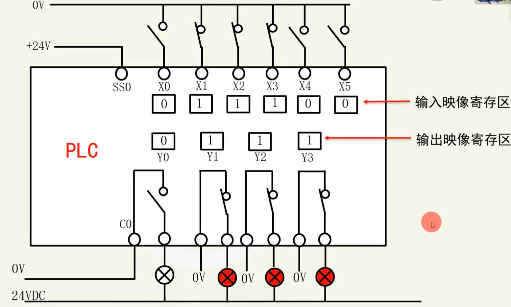

# **PLC的工作原理、扫描过程、双线圈冲突**

## PLC工作原理
> **核心：循环扫描**


PLC（可编程逻辑控制器）并非实时响应每一个输入信号，而是采用一种称为**循环扫描**的工作方式。它周而复始地执行一系列固定的步骤，形成一个循环，每个循环称为一个**扫描周期**。

**关键概念解释：**
*   **流程：** 指的就是上述的扫描周期，即从开始到结束所经历的全部步骤。
*   **输入映像（寄存器）：** 这是PLC内部的一块内存区域。在扫描周期的开始阶段，PLC会**一次性、批量地**读取所有外部输入端子（如X0, X1）的物理状态（ON或OFF），然后将这些状态存入这个区域。可以把它理解为给所有输入信号拍了一张“快照”。在接下来的整个程序执行阶段，PLC都只使用这张“快照”中的数据，而不再关心外部输入点的实际变化，这保证了本周期内处理数据的稳定性。
*   **输出映像（寄存器）：** 这也是PLC内部的一块内存区域，专门用于暂存程序运算后希望输出的结果。在程序执行阶段，所有对于外部输出点（如Y0, Y1）的控制命令都只是更新这个区域里的状态。直到扫描周期的最后，PLC才会将这个区域里的状态**一次性、批量地**复制到实际的物理输出端子上，驱动负载（如指示灯、继电器）动作。

## **PLC工作过程**



**1. 输入与输出的关系**
*   **核心结论：输入和输出之间没有直接的、必然的联系。**


*   输入信号（如按钮按下）只是为PLC提供了原始数据。输出信号（如电机启动）是PLC内部的用户程序根据这些输入数据、结合自身的逻辑（如延时、计数等）进行运算后产生的结果。
*   **误区纠正：** 不能认为“输入X0接通，输出Y0就一定接通”。Y0是否接通，完全取决于程序是如何编写的。PLC只是一个严格按程序执行的“执行者”。

**2. 扫描三步骤**
一个完整的扫描周期包含以下三个核心步骤：

1.  **输入采样（输入刷新）阶段：**
    *   PLC读取所有外部输入点的ON/OFF状态。
    *   将这些状态全部存入**输入映像寄存器**。至此，输入映像寄存器就成为了本周期的“输入数据源”。

2.  **程序执行阶段：**
    *   这是PLC工作的核心。CPU会按照用户编写的程序（梯形图、指令表等），**严格按照“从左到右，从上到下”的顺序**进行扫描和运算。
    *   **程序段扫描：** 对于梯形图，遇到串联触点（与逻辑）就从左到右运算，遇到并联触点（或逻辑）就从上到下运算。每一步的运算结果会立刻影响到内部继电器、计时器、计数器和**输出映像寄存器**的状态。
    *   **关键特性：** 在此阶段，即使程序逻辑使**输出映像寄存器**的状态发生了变化，**实际的物理输出点也不会立即动作**。

3.  **输出刷新（输出更新）阶段：**
    *   当所有用户程序都执行完毕后，PLC将**输出映像寄存器**中存储的状态，**一次性、全部地**传送给实际的外部物理输出点。
    *   只有到了这个阶段，外部设备（如马达、灯泡）才会真正根据程序逻辑开始动作。

完成以上三步后，PLC又回到第一步，开始下一个扫描周期，如此反复循环。

---

## 双线圈冲突

**1. 什么是“双线圈冲突”？**

*   **定义：** 在同一个用户程序中，**同一个输出线圈**（例如Y0）被**多次编程**，出现在不同的网络段或位置。
*   **问题根源：** 由于PLC扫描是**顺序执行**的，对于同一个线圈，**后执行的程序会覆盖先执行程序的结果**。
*   **后果：** 最终输出线圈的状态**只取决于程序中最后一次出现该线圈时的驱动条件**，导致前面的逻辑完全失效，程序行为与设计预期严重不符，是常见的编程错误。

**举个例子（对照课程中的例子理解）：**
假设程序中有两处出现了Y0：
*   **第一处：** 当X0接通时，希望让Y0输出（ON）。
*   **第二处：** 当X1接通时，希望让Y0输出（ON）。

如果按照下图所示编程，就会发生冲突：
```
网络1：
X0 ---- ( Y0 )

网络2：
X1 ---- ( Y0 )
```
*   **PLC的扫描执行过程：**
    1.  扫描网络1：如果X0为ON，则把Y0的**输出映像寄存器**状态设为ON。
    2.  扫描网络2：如果X1为OFF，则把Y0的**输出映像寄存器**状态**重新设为OFF**。
    3.  进入输出刷新阶段：将Y0的最终状态OFF输出到物理端子，灯熄灭。
*   **结果：** 即使X0按钮按下，Y0的灯也不会亮，因为它的状态被后面X1=OFF的网络覆盖了。这就是“双线圈冲突”。

**2. 如何解决“双线圈冲突”？**

**解决方案一：简化布尔逻辑（合并条件）**
*   **原理：** 将驱动同一个线圈的多个条件，通过“或”逻辑合并到**一个线圈**上。
*   **操作：** 将上面例子中的两个网络合并成一个网络。
    ```
            X0      X1
    ----||-------+-------( Y0 )
                 |
    ```
*   **解释：** 这样Y0在程序中只出现了一次。只要X0 **或** X1任意一个为ON，Y0就会得电为ON。从根本上避免了覆盖问题。
*   **适用场景：** 适用于驱动逻辑比较简单的情况。

**解决方案二：使用内部中间继电器（M点）—— 推荐方法**
*   **原理：** 利用PLC内部的“虚拟”继电器（M点）作为中间变量，先存储各个分支的逻辑结果，最后再用这些中间结果来共同驱动最终的输出线圈。
*   **操作（两步法）：**
    1.  **分支暂存：** 将不同的驱动条件输出到不同的M点。
        ```
        网络1： X0 ---- ( M0 )  //X0接通，则M0为ON
        网络2： X1 ---- ( M1 )  //X1接通，则M1为ON
        ```
    2.  **集中驱动：** 用所有相关的M点的触点，来驱动唯一的Y0线圈。
        ```
        网络3： M0      M1
        ----||-------+-------( Y0 )
                     |
        ```
*   **优点：**
    *   **彻底解决冲突：** Y0只被驱动一次，状态不会被覆盖。
    *   **程序清晰易读：** 逻辑分明，易于后期维护和调试。
    *   **灵活性强：** M点的状态还可以用于其他地方（如触摸屏显示、其他逻辑判断）。
*   **适用场景：** 尤其适用于逻辑复杂、分支多的场合，是工程中的标准做法。

**总结：** 解决双线圈冲突的核心就是遵循 **“一个输出线圈，在程序中只被驱动一次”** 的原则。