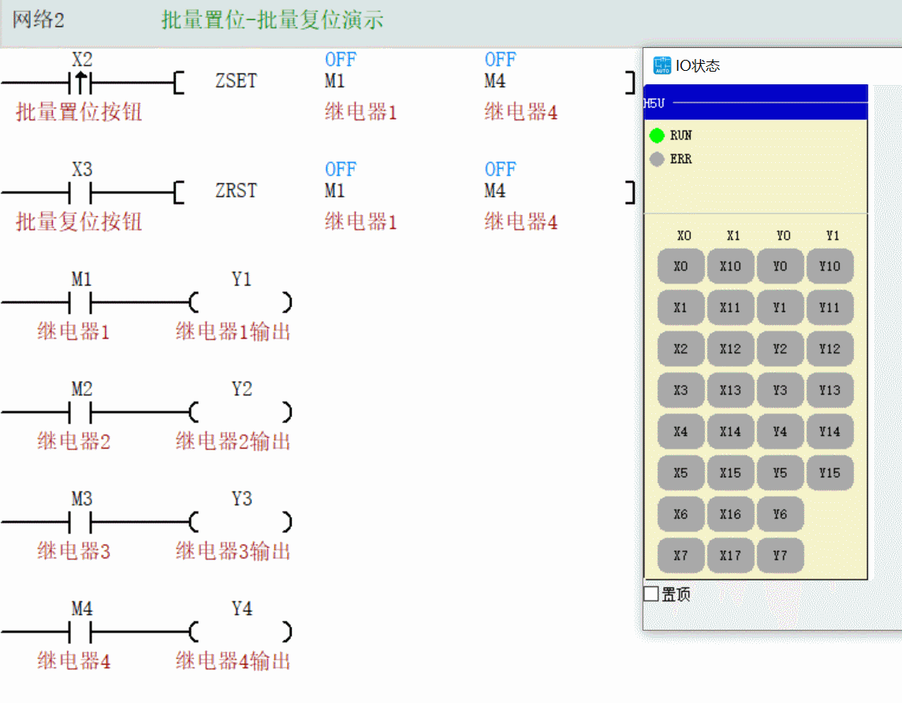
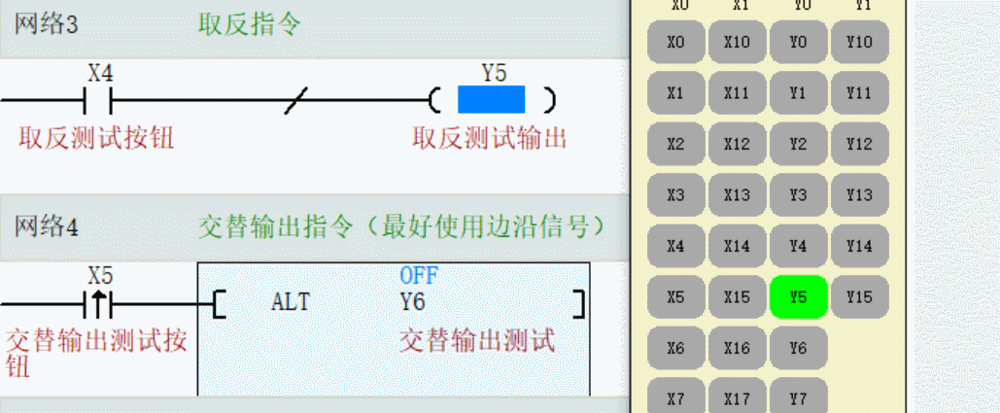

## **本节课程大纲总结**

本次课程主要讲解了汇川PLC编程中用于状态保持和批量操作的核心指令，可分为以下三个部分：
1.  **基本位操作指令**：置位（SET）与复位（RST）指令的功能、特点及应用。
2.  **批量操作指令**：区域置位（ZSET）与区域复位（ZRST）指令的功能及使用注意事项。
3.  **其他辅助指令**：运算结果取反（INV）与交替输出（ALT/ALTY）指令的说明与应用场景。

---

## **知识点归纳总结**

### **1. 置位指令**

*   **指令**：`SET Y0`
*   **说明与作用**：当触发条件满足时，将指定的软元件（如输出Y、内部继电器M、状态S、数据寄存器D等）的状态设置为ON（1）。
*   **效果与特点**：
    *   **保持性（自锁特性）**：最主要的特点。一旦被置位，即使触发条件消失，该元件的ON状态也会一直保持，直到被专门的复位指令清除。如同一个“启动后自锁”的开关。
    *   **与普通线圈的区别**：普通线圈的输出状态随触发条件的通断而即时通断；置位指令则实现了一种“点动启动，长期运行”的效果。
    *   **应用场景**：常用于设备的启动、运行状态的保持。

### **2. 复位指令**

*   **指令**：`RST Y0`
*   **说明与作用**：强制将指定的软元件状态清除，即设置为OFF（0）。
*   **效果与特点**：
    *   **强制性**：无论目标元件当前是ON还是OFF，执行复位指令后都会被强制为OFF。
    *   **与置位指令配对使用**：是解除置位指令所保持状态的唯一直接方法。如同一个“停止”或“总清”开关。
    *   **应用场景**：常用于设备的停止、急停、状态清零和程序初始化。

### **3. 使用时的注意事项及技巧**

*   **避免持续触发**：**（学霸同学重点强调）** 如果使用常开触点等持续信号直接触发SET/RST，可能导致输出无法停止或误动作。建议与**上升沿（P）** 或**下降沿（N）** 触发配合使用，确保指令只在信号变化的瞬间执行一次，使控制更精确、安全。
*   **不受“双线圈”规则限制**：在程序的多个位置对同一元件使用SET和RST指令是允许的，这简化了复杂逻辑的编程。
*   **明确控制关系**：编程时应确保每个置位操作都有对应的、逻辑清晰的复位操作，避免状态混乱。

### **4. 批量置位和批量复位**

*   **指令**：
    *   批量置位：`ZSET Y0 Y1`（或`BSET Y0 Y1`，依具体PLC型号而定）
    *   批量复位：`ZRST Y0 Y1`（或`BRST Y0 Y1`，依具体PLC型号而定）
*   **说明与作用**：用于对**连续地址范围内**的多个同类软元件进行一次性批量操作。ZSET将整个区域的元件置位，ZRST将整个区域的元件复位。
*   **注意事项**：
    *   **地址范围正确**：操作数必须是同一类型的软元件（如全是Y点或全是M点）。
    *   **地址顺序**：起始地址必须小于等于结束地址（如 `Y0 Y7`）。如果顺序写反（如 `Y7 Y0`），指令可能不执行或仅对最后一个地址（Y0）进行操作，需查阅具体手册确认。
*   **优势**：极大简化了对多个输出点或中间状态进行统一开启/关闭的逻辑，使程序更简洁。

### **5. 运算结果指令及说明**

*   **指令**：运算结果取反 `INV`(直接回车)
*   **说明与作用**：该指令不操作软元件，而是对**它之前**的逻辑运算（如与、或）的最终结果进行取反（ON变OFF，OFF变ON），然后将取反后的结果输出给后面的指令（如驱动线圈）。
*   **特点**：可以理解为在逻辑电路中串联一个“非门”，它改变了流经整个电路的“能流”状态。

### **6. 交替输出指令及说明**

*   **指令**：交替输出 `ALT` 或 `ALTY`
*   **说明与作用**：每检测到一次触发信号的**上升沿**，目标元件的输出状态就在ON和OFF之间切换一次。
*   **效果**：实现“按一下开启，再按一下关闭”的开关切换功能，非常适合**单按钮启停控制**场景。
*   **特点**：用一个输入点即可实现输出的保持与解除，节省I/O资源，逻辑简洁。

**注意：如果交替输出不使用边沿信号，将会造成频闪效果，猜测是一个扫描周期删一次**

## **补充说明**
*   “累计缓存器”通常称为“运算结果寄存器”或类似概念，是PLC内部用于暂存逻辑运算结果的一个区域。