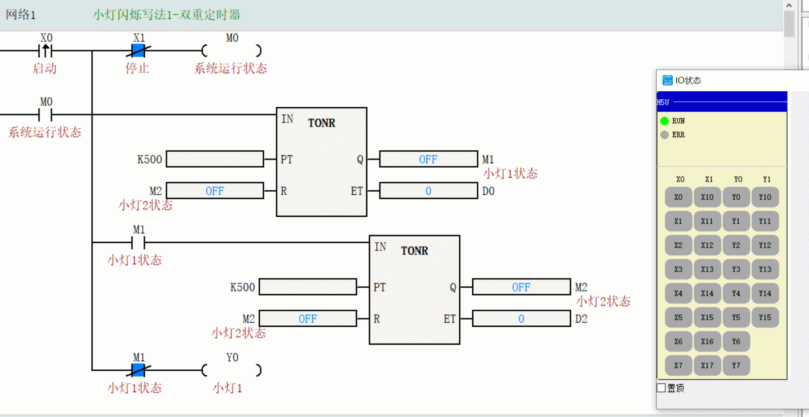
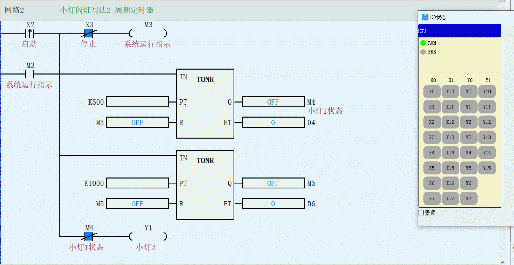

### **一、 本节课程大纲总结**

本次课程的核心主题是**使用PLC定时器实现小灯闪烁电路的多种编程方法**。大纲如下：

1.  **课程引入**：明确小灯闪烁的控制要求（亮0.5秒，灭0.5秒，带启停功能）。
2.  **核心原理**：讲解利用PLC内部定时器构建时间控制逻辑的基本思想。
3.  **方法详解**：重点讲解三种不同的编程实现方法。
**方法一（双重定时器）**：两个定时器分别控制亮、灭时间。

**方法二（周期定时器）**：一个定时器控制半周期，另一个控制全周期并负责复位。

**方法三（单按钮法）**：适用于亮灭时间相同的简化方法。

4.  **相关知识**：介绍PLC扫描周期的调整及其对程序运行的影响。
5.  **课后作业**：布置了进一步实践和探索的任务。

---

### **二、 根据指定节点归纳总结**

#### **1. 闪烁电路练习要求**

*   **基本功能要求**：
    *   **输出**：Y0 小灯按“亮0.5秒 -> 灭0.5秒”的节奏循环闪烁。
    *   **输入**：X0 作为启动按钮，X1 作为停止按钮。
    *   **核心元件**：使用PLC内部的定时器实现精确的时间控制。
*   **设计要点（学霸补充）**：
    *   **标志位使用**：通常使用一个中间继电器（如M0）作为系统的运行状态标志，受X0（启动）和X1（停止）控制。
    *   **逻辑关键**：闪烁的本质是两个定时器交替工作、相互触发和复位，形成循环。要特别注意定时器输出点（如M1, M2）的状态变化如何通过常开/常闭触点连锁控制输出Y0和另一个定时器。

#### **2. 改变PLC扫描周期**

*   **目的**：优化CPU使用率。当程序复杂度变化时，让扫描周期动态调整，避免CPU资源浪费。
*   **操作方法**：在编程软件中，双击“程序块”，找到并**取消勾选“恒定扫描周期”** 选项。
*   **重要提醒（学霸补充）**：**此设置必须在程序下载到PLC之前完成**，否则修改无效。

#### **3. 三种写法的区别**

以下是对三种编程方法的对比归纳：

| 特性 | 方法一：双重定时器 | 方法二：周期定时器 | 方法三：单按钮法 |
| :--- | :--- | :--- | :--- |
| **核心原理** | 两个定时器**独立且串联**，分别控制“亮”和“灭”的时长。 | 一个定时器控制**半周期（亮或灭）**，另一个定时器控制**全周期**并负责**复位**。 | 利用**单个定时器**的输出状态直接**交替**控制输出。 |
| **逻辑流程** | T1计时（亮）→ T1动作，启动T2并灭灯→ T2计时（灭）→ T2动作，复位T1/T2，重新开始。 | T1计时（控制Y0状态）→ T2计时（记录总周期）→ T2动作，**同时复位T1和T2**→ 重新开始循环。 | 启动后，定时器到达设定值即触发输出状态翻转，并自复位重新计时。 |
| **优点** | 逻辑**清晰直观**，易于理解和调试，亮灭时间**独立可调**，应用最广。 | 程序**更简洁高效**，减少了触点逻辑，通过周期复位确保循环的准确性。 | **代码最简练**，仅使用一个定时器，适用于快速实现。 |
| **缺点/局限** | 使用了两个定时器，逻辑稍显冗长。 | 对复位逻辑的**同步性**要求高，理解难度稍大。 | **仅适用于亮灭时间完全相同的场景**，灵活性差。 |
| **适用场景** | **通用方案**，尤其适用于亮、灭时间不同的复杂闪烁需求。 | **推荐的优化方案**，适用于标准周期闪烁，是更专业的写法。 | **特定简化方案**，适用于对称方波（占空比50%）的快速实现。 |

**总结**：方法一（双重定时器）是基础，方法二（周期定时器）是优化，方法三（单按钮法）是特例。在实际工程中，根据控制的复杂度和灵活性要求选择合适的方法。