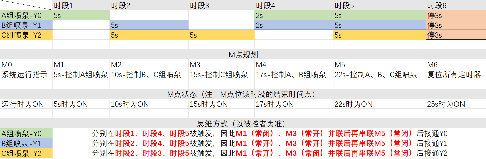

### 本节课程大纲总结
本节课程主要讲解了一个复杂定时时序的喷泉控制程序设计，通过时序图绘制和分段计时的方法，实现PLC对三组喷泉（A、B、C）的循环控制。大纲包括：
- **喷泉控制需求**：使用X0启动、X1停止，控制喷泉组（A/Y0、B/Y1、C/Y2）在特定时间段工作，循环周期为25秒（包括3秒停止）。
- **时序图设计方法**：将整个流程分解为多个时间段，每个时间段用独立定时器（M触点）控制，便于理解逻辑关系。
- **输出控制逻辑**：基于时序图，组合多个定时器的输出信号，驱动喷泉组动作。
- **编程技巧**：强调分段计时法的实用性，作为初学者实现复杂时序的基础，后续可优化。

### 根据节点归纳总结
#### 1. 喷泉控制练习要求
- **控制对象**：三组喷泉（A、B、C），对应PLC输出点Y0、Y1、Y2。
- **启动/停止**：X0为启动信号，X1为停止信号。
- **执行流程**：启动后按顺序执行以下阶段（循环）：
  - A组单独喷5秒 → B组和C组同时喷5秒 → C组单独喷5秒 → A组和B组同时喷2秒 → A、B、C三组同时喷5秒 → 所有喷泉停止3秒。
- **实现目标**：通过PLC编程准确控制各时间段，确保喷泉组按时序工作。

#### 2. 程序时序图绘制（有这方面的软件吗？）
- **时序图作用**：可视化各喷泉组在不同时间点的状态（开/关），简化复杂逻辑设计。
- **绘制软件**：
  - **专业PLC工具**：如三菱GX Works、西门子TIA Portal等编程软件自带时序图功能，可模拟运行。
  - **通用绘图软件**：如Visio、Lucidchart、Draw.io，支持绘制时序图；也可用PPT或手绘草图。
  - **在线工具**：如Miro、GitMind等协作平台提供时序图模板。
- **建议**：初学者先手绘草图明确时间关系，再使用软件细化，确保时间段划分准确（如0-5秒、5-10秒等）。

#### 3. 时序图转换梯形图步骤
根据课程内容，转换过程需遵循以下步骤（以纪要优先，补充不足处）：
- **① 起保停**：
  - 设计启动-保持-停止电路，确保系统稳定运行。例如，用X0启动一个总控继电器（如M0），X1停止时复位M0，从而控制整个循环的启停。
  - **补充**：需加入循环逻辑，如最后一个定时器（M6）完成后复位所有定时器，重新触发M0，实现循环。
- **② 根据时序设置M触点**：
  - 将循环周期划分为多个时间段，每个时间段用一个定时器（如T0、T1等）和对应的M触点（如M1、M2等）作为标志。例如：
    - M1：0-5秒（A组工作）
    - M2：5-10秒（B和C组工作）
    - M3：10-15秒（C组工作）
    - M4：15-17秒（A和B组工作）——注意：实际课程中M4可能对应15-17秒，但需根据定时器值调整。
    - M5：17-22秒（ABC三组工作）
    - M6：22-25秒（停止阶段）
  - **补充**：定时器值以毫秒设置（如5000=5秒），注意时间节点包含关系（如"M1常闭"表示0-5秒的开区间）。
- **③ 同一个M触点控制该时序内的喷泉**：
  - 对于每个喷泉组，根据时序图确定其工作时间段，使用对应M触点的组合逻辑控制输出。例如：
    - Y0（A组）：在M1期间和M3到M5期间工作，因此Y0 = (M1的常闭触点) OR (M3 AND NOT M5) —— 需根据实际逻辑调整。
    - Y1（B组）：在M2期间和M3到M5期间工作，因此Y1 = M2 OR (M3 AND NOT M5)。
    - Y2（C组）：在M2、M3和M3到M5期间工作，因此Y2 = M2 OR M3 OR (M3 AND NOT M5)。
  - **补充**：需注意M触点的上升沿或下降沿控制，确保时间点准确；输出逻辑应使用OR指令组合多个时间段。

> 效果演示（加快五倍速）

**不足与补充**：课程中强调，初学者程序可能冗长，但功能优先。后续学习高级指令（如步进顺控指令）可简化代码。此外，定时器需正确复位，避免累积误差。