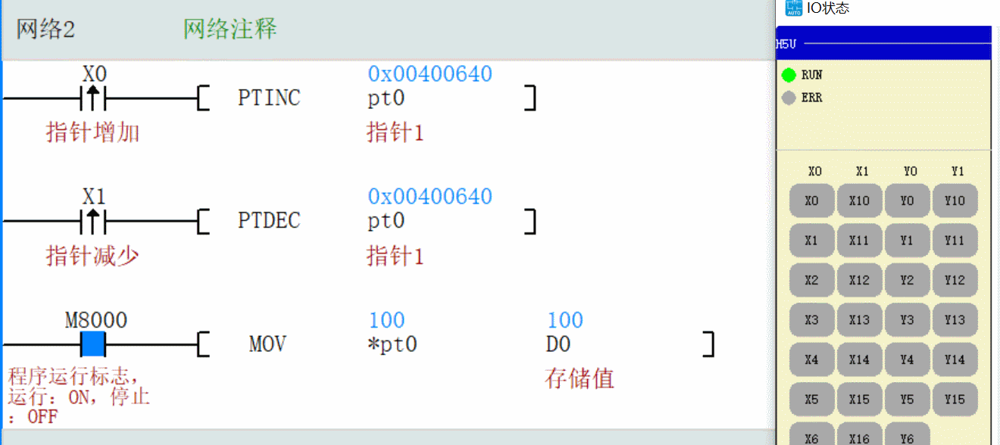

### **本节课程大纲总结**

本节课程主要围绕**PLC高级编程技术**展开，核心内容包括三大模块：
1.  **指针变量及其应用**：深入讲解指针的概念、操作指令及其在简化程序、动态寻址方面的强大功能。
2.  **数据传送指令**：系统学习多种数据传送方式，从基础的单数据传送到高效的批量数据处理指令。
3.  **数据比较指令**：掌握直接比较、区域比较以及更直观灵活的触点比较指令，实现复杂的逻辑判断。

最后，课程通过一个**交通灯控制系统的综合案例**，将上述知识点融会贯通，展示实际工程中的应用。

---

### **知识点归纳总结**

#### **一、 指针和指针寻址及其应用技巧**

*   **核心概念**：指针是一个**地址变量**，它存储的不是数据本身，而是其他软元件（如D、Y、M）的**地址**。这好比一个“地址簿”或“门牌号”，通过操作地址来间接操作数据，极大地增强了程序的灵活性。
*   **定义**：在H5U PLC的**变量表中定义**，类型为`POINTER`，初始值为`NULL`。注意，指针变量本身断电不保存。

*   **关键指令与应用技巧**：
    *   `PTGET`： 将具体地址（如`D100`）赋予指针变量（如`pt0`），完成“地址绑定”。
    *   `PTINC`/`PTDEC`： 指针地址递增/递减（如`D100` -> `D101`），用于**顺序访问**连续地址。**技巧**：通常需配合脉冲执行（`P`）避免连续触发。
    *   `PTADD`： 给指针地址增加一个**偏移量**（如一次性+10），实现**快速跳转**，比单步递增更高效。
    *   `*`（星号操作）： **解引用**，用于读写指针**当前指向的地址里的数据值**。这是区分“地址”和“数据”的关键。
    *   `PTMOV`： 将一个指针的地址值复制给另一个指针。
*   **核心优势**：用**一套通用程序**处理不同地址的数据块，避免编写大量重复代码。例如，通过改变指针指向，同一段程序即可处理`D100`开始的区域，也可处理`D200`开始的区域。

#### **二、 数据传送与数据比较**

##### **1. 赋值传送MOV**
*   **指令**： `MOV`（16位）、`DMOV`（32位双字）。
*   **功能**：将源操作数`S`的值复制到目标操作数`D`。
*   **关键区别**：
    *   **连续执行**：每个扫描周期都执行。
    *   **脉冲执行（`_P`）**：仅在控制条件**从OFF变为ON的上升沿**执行一次。**技巧**：常用于初始化、单次触发等场景，防止重复写入。
*   **传送双字注意事项**：定时器（T）的设定值和当前值均为32位数据，操作时必须使用`DMOV`指令。

##### **2. 其他传送指令**
*   **浮点数传送指令（`DEMOV`）及其应用**：专门用于传送浮点数（小数）。**注意**：必须用`DEMOV`传送浮点数（如3.14159）至32位寄存器，使用`MOV`会导致数据类型错误。
*   **数据批量传送指令（`BMOV`）及其应用**：**多对多**传送。将从源起始地址`S`开始的`N`个连续数据，传送到目标起始地址`D`开始的`N`个连续地址中。适用于数据块的快速复制。
*   **多点传送FMOV（`FMOv`）及其应用**：**一对多**传送。将**同一个**源数据`S`，复制到从目标起始地址`D`开始的`N`个连续地址中。适用于一片寄存器的批量初始化（如全部清零或设為同一初始值）。
*   **取反传送CML（`CML`）及其应用**：将源数据`S`的二进制每一位（0和1）**取反**后传送给目标`D`。**注意**：这是二进制位取反，而非十进制数值的负号。

##### **3. 比较指令**
*   **比较指令CMP及其应用**：
    *   **功能**：比较两个数`S1`和`S2`的大小。
    *   **结果输出**：结果通过**三个连续的位软元件**（如`M0`, `M1`, `M2`）表示：
        *   `M0` ON： `S1 > S2`
        *   `M1` ON： `S1 = S2`
        *   `M2` ON： `S1 < S2`
    *   **特点**：结果具有“互斥性”，同一时刻只有一个输出为ON。这三个状态位可像普通触点一样用于驱动后续逻辑。
*   **区域比较ZCP及其应用**：
    *   **功能**：判断一个数`S`是否位于下限`S1`和上限`S2`构成的区间内。
    *   **结果输出**：同样通过三个连续位表示：
        *   `D` ON： `S < S1`（小于下限）
        *   `D+1` ON： `S1 ≤ S ≤ S2`（在区间内）
        *   `D+2` ON： `S > S2`（大于上限）
*   **触点比较及其应用（整数/浮点数）**：
    *   **形式**：将比较条件（如`>`, `<`, `=`, `<=`等）直接以**触点形式**呈现在梯形图中，如 `LD > D0 K5`。
    *   **类型**：支持16位整数（默认）、32位整数（指令后加`D`，如`LDD>`）、浮点数（指令前加`F`，如`FLD>`）。
    *   **核心优势**：**编程直观、灵活**，可以轻松组合多个条件（如`D0 > 5 AND D0 < 10`），比CMP和ZCP指令更简洁，在实际编程中应用广泛。

#### **三、 定时器应用-交通灯控制**

##### **1. 控制要求及IO分配**
*   **控制要求**：东西方向和南北方向信号灯循环工作。
    *   **东西方向**： 绿灯亮5秒 -> 闪烁3次（3秒）-> 黄灯亮2秒 -> 红灯亮10秒。
    *   **南北方向**： 红灯亮10秒 -> 绿灯亮5秒 -> 闪烁3次 -> 黄灯亮2秒。
*   **IO分配**（示例）：
    | 方向 | 信号 | 输出点 | 方向 | 信号 | 输出点 |
    | :--- | :--- | :--- | :--- | :--- | :--- |
    | 东西 | 绿灯 | Y0 | 南北 | 红灯 | Y3 |
    | 东西 | 黄灯 | Y1 | 南北 | 绿灯 | Y4 |
    | 东西 | 红灯 | Y2 | 南北 | 黄灯 | Y5 |

##### **2. 控制思路分析**
*   **核心思想**：使用一个**总定时器**（如T0）累计整个循环周期（20秒）的时间。
*   **编程实现**：
    1.  启动后，总定时器开始计时。
    2.  利用**触点比较指令**，根据总定时器的当前值（毫秒）来划分不同的时间段，并控制对应的输出点。
        *   **例如东西方向绿灯**： `(D0 >= 0) AND (D0 <= 5000)` -> `Y0` 输出。
        *   **例如东西方向绿灯闪烁**： `(D0 > 5000) AND (D0 <= 8000)` -> `Y0` 由一秒时钟脉冲驱动闪烁。
        *   **例如东西方向黄灯**： `(D0 > 8000) AND (D0 <= 10000)` -> `Y1` 输出。
    3.  一个周期结束后，复位总定时器，开始下一个循环。
*   **知识点融合**：此案例完美结合了**定时器**、**触点比较指令**（进行时间段判断）和**传送指令**（可用于灵活设置时间参数），是本章知识的典型综合应用。