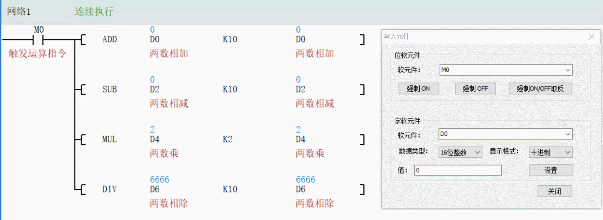
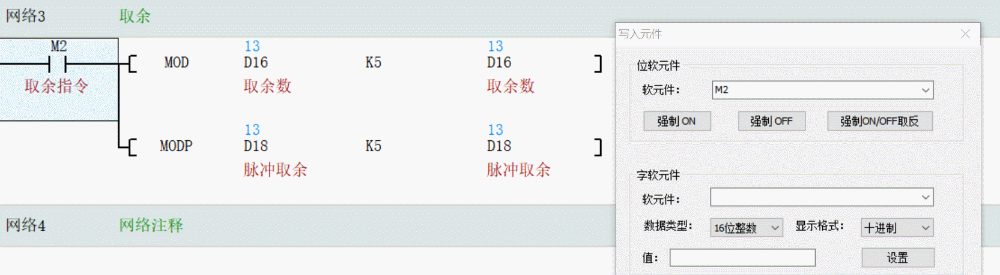
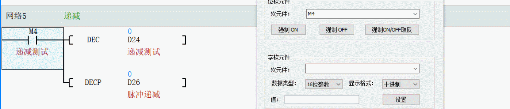
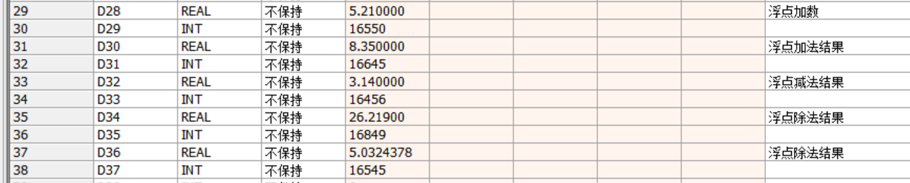
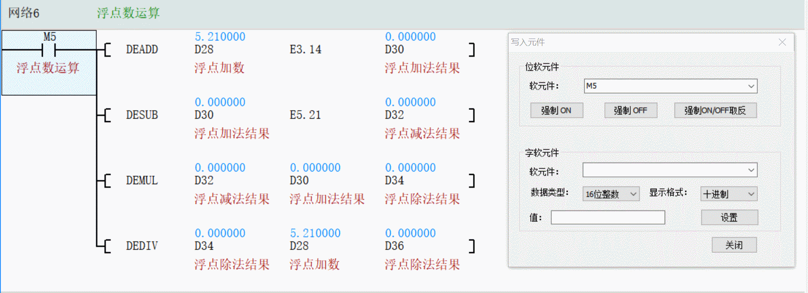
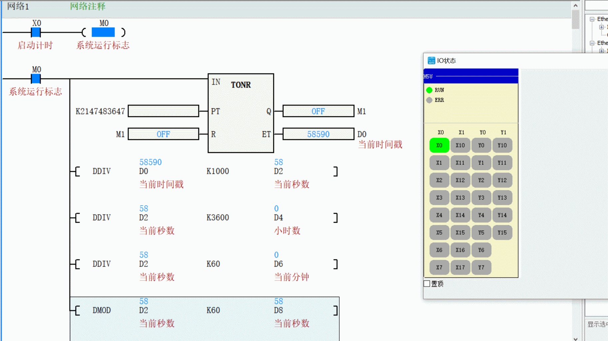
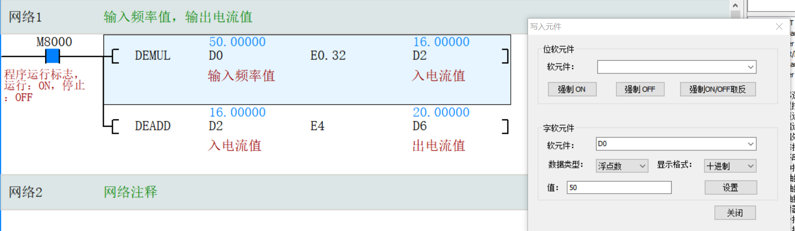

### 课程大纲总结
本节课程主要讲解PLC中的整数与浮点数运算指令，包括基本指令、执行方式、编程注意事项以及实践应用。内容分为四部分：
1. **整数运算指令**：介绍ADD、SUB、MUL、DIV等基本运算，以及数据类型、执行方式和运算标志。
2. **整数专用运算指令**：涵盖求余（MOD）、递增（INC）和递减（DEC）指令的特性和应用。
3. **浮点数运算指令**：讲解浮点数运算格式、数据转换要求和运算标志。
4. **实践案例分析**：通过计时程序、小灯闪烁控制和变频器频率转换三个案例，巩固指令的使用。
课后作业要求完成三个实践编程练习。

### 节点归纳总结
以下根据指定节点进行详细归纳，结合文档和学霸同学笔记，确保内容完整。

#### 1. 整数运算指令
- **基本指令**：包括ADD（加）、SUB（减）、MUL（乘）、DIV（除）四种运算。整数除法仅返回商，不产生小数。
- **数据类型**：16位整数运算结果需在-32768到32767范围内；16位整数相乘结果为32位双整数（范围更大）。
- **执行方式**：有连续执行和脉冲执行（加后缀"P"）两种形式。脉冲执行（如ADDP）在条件满足时只执行一次，连续执行则持续进行。
- **运算标志**：运算会触发标志位，如零标志（M8020，结果为零时置位）、溢出标志（M8022，结果超出范围时置位）和借位标志（M8021，结果小于最小值时置位）。
- **补充**：32位运算需在指令前加"D"（如DADD），并注意地址分配（使用双字地址，避免重叠）。

#### 2. 加P与不加P的区别
- **加P（脉冲执行）**：条件满足时仅执行一次，适用于需要避免重复运算的场景，如累积计数（自加、自减），能保证结果稳定性。

- **不加P（连续执行）**：条件满足时每个扫描周期都执行，可能导致数值指数级增长（因PLC扫描周期快，约11毫秒），易引发溢出错误。

- **应用建议**：推荐在需要精确控制次数的运算中使用脉冲执行，而连续运算需谨慎使用，或结合上升沿触发来避免失控。

#### 3. 编程注意事项
- **数据类型匹配**：整数和浮点数不能直接混用。浮点数运算时，整数必须转换为浮点格式（如5.0，而非K5）。
- **除数不能为零**：除法指令（DIV/MOD）中除数为零会触发"数据不合理"报警，编程前需校验除数。
- **地址分配**：32位运算时，寄存器地址需使用双字并间隔偶数地址（如D0和D2），避免地址冲突。
- **运算范围监控**：16位整数运算需警惕溢出，超出范围时使用32位或浮点数运算。
- **初始化**：使用M8002（上电脉冲）对寄存器清零，确保每次上电从零开始，除非需保留历史数据。
- **标志位处理**：注意零标志、进位标志和借位标志对后续逻辑的影响，尤其在连续运算中。
- **补充**：乘法结果存储需注意数据类型（16位乘16位结果存32位），避免数据截断。

#### 4. 求余
- **指令**：MOD，用于计算整数除法的余数（如10÷3余1）。

- **适用场景**：仅适用于整数运算，浮点数无余数概念。
- **注意事项**：除数不能为零；除数为负数时，余数也为负数。
- **应用示例**：在计时程序中，用求余分解时间（如总秒数除以3600余数再除以60，得到分钟和秒）。

#### 5. 递增
- **指令**：INC，使指定地址的数值加1。

- **特性**：不受零标志或进位标志影响；达到最大值（如16位整数的32767）时再加1会循环到最小值（-32768）。
- **应用**：常用于计数器，如记录输入点（X0）接通次数。在H5U PLC中可替代专用计数器指令。

#### 6. 递减
- **指令**：DEC，使指定地址的数值减1。

- **特性**：类似递增，达到最小值（-32768）时再减1会循环到最大值（32767）。
- **应用**：用于减法计数或循环控制，如递减计数到零时触发动作。

#### 7. 浮点数运算
- **指令**：在整数指令前加"DE"（如DEADD、DESUB），操作数和结果均为浮点数。
- **数据格式**：必须使用浮点格式（如5.0），整数需显式转换（不能直接用K5），软元件表内需要更改为REAL。

- **运算标志**：结果为零时零标志置位；超出浮点数范围时进位标志置位。

- **精度问题**：浮点数有效数字约7位，运算可能四舍五入产生微小误差，但工程中通常可接受。
- **应用示例**：变频器频率转换中，处理线性比例计算（如电流与频率的换算）。

#### 8. 三个小练习要求
- **计时程序**：编写显示时分秒的程序。使用定时器获取毫秒值，通过整数除法和求余转换：总毫秒÷1000得秒，再÷3600得小时，余数÷60得分钟，最终余数为秒。需处理超过24小时的情况（用天数计数器）。
注意：TONR接通延时计时器`2147483647`，具体需要看是几位的，16位就是2^16-1，32位就是2^32-1

- **小灯闪烁控制程序**：用INC记录X0接通次数，按下X1后通过定时器控制Y0闪烁。闪烁次数与X0次数相等时停止（比较寄存器值），并重置计数。注意使用脉冲执行避免误触发。

- **变频器控制程序**：根据4-20mA电流与0-50Hz频率的线性关系（公式：电流B = 0.32 × 频率a + 4），编写浮点数运算程序。输入频率值，计算对应电流值，并输出到模拟量模块。

### 补充说明
- 本总结基于课程文档和学霸同学笔记，重点突出了实践中的关键点。如有不足，建议在实际编程中注意调试和验证，特别是标志位和数据类型转换的细节。
- 对于复杂运算，可结合触摸屏设定参数，增强程序的灵活性。