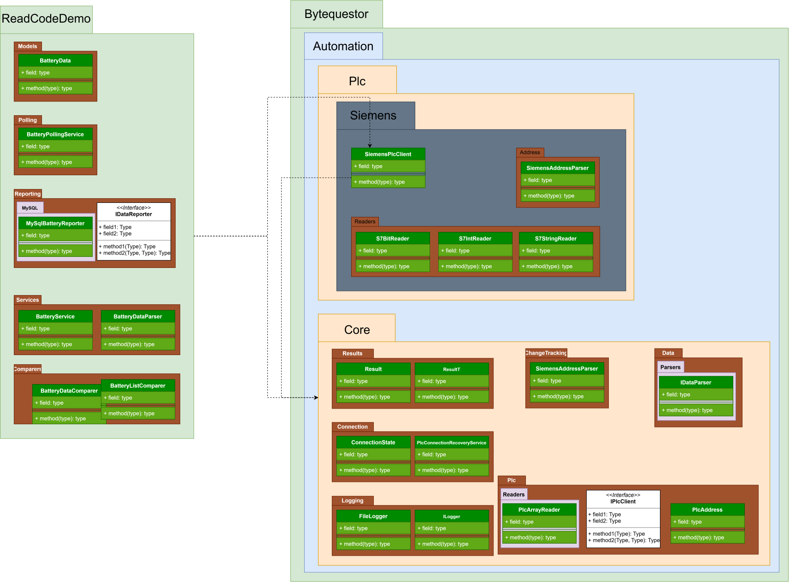

# 一、这个案例要做什么
不是只解决这一次 `Battery_Data`。
而是做一个以后可以反复使用的：
> **上位机自动化基础类库**
以后新建一个项目，例如：
```text
海辰组盘机
PACK测试机
电芯检测机
扫码设备
机器人上下料
```

都可以直接引用：
```text
ByteQuestor.Automation.Core
ByteQuestor.Automation.Plc.Siemens
```

然后业务项目只需要写：

```csharp
var batteries = await batteryService.ReadAllAsync();
```

而不是每个项目重新写：

```text
PLC连接
PLC读取
Byte转换
String解析
BOOL解析
INT解析
结构体解析
异常处理
```

---

# 二、先看最终项目结构

目前是：



```text
ByteQuestor.Automation
│
├── ReadCodeDemo
│
├── ByteQuestor.Automation.Core
│
└── ByteQuestor.Automation.Plc.Siemens
```
最终逐渐发展成下面这样：
```text
ByteQuestor.Automation                         【解决方案】
│
├── ReadCodeDemo                                【业务项目 / Demo】
│   │
│   ├── Models                                  【业务模型层】
│   │   └── BatteryData.cs
│   │
│   ├── Services                                【业务服务层】
│   │   ├── BatteryService.cs
│   │   └── BatteryDataParser.cs
│   │
│   ├── Forms                                   【UI表现层】★后续整理
│   │   └── Form1.cs
│   │
│   └── Program.cs
│
│
├── ByteQuestor.Automation.Core                【核心基础层】
│   │
│   ├── Plc                                     【PLC抽象层】
│   │   ├── IPlcClient.cs
│   │   └── PlcAddress.cs
│   │
│   ├── Data                                    【通用数据层】
│   │   └── ...                                 ★后续
│   │
│   ├── Results                                 【统一结果层】
│   │   ├── Result.cs
│   │   └── ResultT.cs
│   │
│   ├── Extensions                              【通用扩展层】
│   │   └── ...                                 ★后续
│   │
│   └── Utilities                               【通用工具层】
│       └── ...                                 ★后续
│
│
└── ByteQuestor.Automation.Plc.Siemens         【西门子实现层】
    │
    ├── SiemensPlcClient.cs                     【PLC通讯实现】
    │
    ├── Address                                 【西门子地址层】
    │   └── SiemensAddressParser.cs
    │
    └── Data                                    【西门子数据解析层】
        │
        └── Readers
            ├── S7StringReader.cs
            ├── S7IntReader.cs
            └── S7BitReader.cs
```

**先记住这一棵树。**
后面所有代码，都要问：

> **“它应该挂在哪个树枝上？”**

---

# 三、最重要：三大项目到底干什么？

整个架构可以简单理解成：

```text
                  ByteQuestor.Automation
                          │
          ┌───────────────┼───────────────┐
          ↓               ↓               ↓
     ReadCodeDemo        Core          Plc.Siemens
      【业务】          【基础】          【实现】
          │               │               │
          │               │               │
      我要电池数据       我规定标准        我负责西门子
          │               │               │
          └───────────────┼───────────────┘
                          ↓
                         PLC
```

---

# 四、① ReadCodeDemo —— 业务层

这是最容易理解的一层。

它代表：
> **“现在正在做的这台设备/这个项目。”**

例如：

```text
ReadCodeDemo
```

以后也可能变成：

```text
HaichenAssembly
PackTester
CellTester
RobotStation
```

---

## Models —— 业务模型层

```text
ReadCodeDemo
└── Models
    └── BatteryData.cs
```

这里放：

> **PLC数据经过解析以后，在C#里面长什么样。**

例如：

```csharp
public class BatteryData
{
    public string BarCode { get; set; }

    public int State { get; set; }

    public bool Have { get; set; }

    public bool ScanOk { get; set; }

    public bool ScanNg { get; set; }
}
```

PLC原来是：

```text
36 Byte
```

经过解析：

```text
36 Byte
   ↓
BatteryData
```

所以：

```text
Models
=
“数据长什么样”
```

---

# 五、Services —— 业务服务层

```text
ReadCodeDemo
└── Services
    ├── BatteryService.cs
    └── BatteryDataParser.cs
```

这一层非常重要。

它负责：

> **“我要完成什么业务。”**

例如：

```text
读取10个Battery
读取扫码结果
判断扫码是否成功
获取当前电池状态
```

### BatteryDataParser

负责：

```text
36 Byte
   ↓
BatteryData
```

它知道：

```text
0~30      → BarCode
32~33     → State
34.0      → Have
34.1      → Scan_OK
34.2      → Scan_NG
```

注意：

这些东西是**你的 Battery 项目自己的结构定义**。

所以它属于：

```text
ReadCodeDemo
```

而不是 Core。

---

# 六、② ByteQuestor.Automation.Core —— 核心基础层

这个项目是整个框架最重要的东西。

你可以把它理解成：

> **“所有自动化项目共同遵守的规则。”**

它不知道你现在是什么机器。

也不知道：

```text
Battery
Groupip
扫码
机器人
```

它只提供：

```text
PLC应该怎么抽象
数据怎么返回
通用工具怎么处理
```

---

# 七、Core → Plc —— PLC抽象层

```text
Core
└── Plc
    ├── IPlcClient.cs
    └── PlcAddress.cs
```

### IPlcClient

它定义：

> **“一个PLC客户端应该具备什么能力。”**

例如：

```csharp
ConnectAsync()
DisconnectAsync()
ReadBytesAsync()
WriteBytesAsync()
```

它不管：

```text
西门子怎么连接
欧姆龙怎么连接
汇川怎么连接
```

它只规定：
> 作为一个 PLC Client，必须能连接、断开、读、写。

---

# 八、为什么需要 IPlcClient？

因为以后可能遇到：
```text
西门子
欧姆龙
汇川
三菱
Modbus
```
如果没有接口，业务代码可能写成：

```csharp
SiemensPlcClient plc = ...
```

那么以后换欧姆龙：

```text
整个业务层全部改
```

有了：

```csharp
IPlcClient
```

业务层只认识：

```text
IPlcClient
```

下面可以换：

```text
             IPlcClient
                 │
        ┌────────┼────────┐
        ↓        ↓        ↓
     Siemens   Omron   Inovance
```

这就是**解耦**。

---

# 九、PlcAddress —— 地址抽象

```text
Core
└── Plc
    └── PlcAddress.cs
```

它代表：

> **“要访问PLC里的某个位置。”**

Core不应该直接认识：

```text
DB100
DBX
M100
D100
FINS
```

所以先统一成：

```csharp
new PlcAddress("DB100.5616")
```

然后：

```text
Core
   ↓
“给我这个地址的数据”
```

具体怎么解释：

```text
DB100.5616
```

由：

```text
Siemens
```

自己解决。

---

# 十、③ ByteQuestor.Automation.Plc.Siemens —— 西门子实现层

这个项目的定位非常简单：

> **所有“西门子特有”的东西都放这里。**

例如：

```text
S7.NetPlus
CpuType
DB
DBX
S7 STRING
S7 INT
S7 BOOL
```

都不应该污染 Core。

---

# 十一、SiemensPlcClient —— PLC通讯实现

```text
ByteQuestor.Automation.Plc.Siemens
└── SiemensPlcClient.cs
```

它负责：

```text
连接 Siemens PLC
       ↓
读取 Siemens PLC
       ↓
写入 Siemens PLC
       ↓
断开 Siemens PLC
```

它实现：

```csharp
IPlcClient
```

所以关系是：

```text
Core
│
└── IPlcClient
       ↑
       │ 实现
       │
Siemens
│
└── SiemensPlcClient
```

---

# 十二、Address —— 西门子地址解析层

```text
Siemens
└── Address
    └── SiemensAddressParser.cs
```

这个类负责：

```text
DB100.5616
```

解析成：

```text
DB = 100
Byte = 5616
```

为什么放 Siemens？

因为：

```text
DB100.5616
```

是西门子的概念。

以后如果是欧姆龙：

```text
D100
```

它的解析方式完全不同。

所以：

```text
SiemensAddressParser
```

绝对不能放 Core。

---

# 十三、Data → Readers —— 西门子数据解析层

```text
Siemens
└── Data
    └── Readers
        ├── S7StringReader.cs
        ├── S7IntReader.cs
        └── S7BitReader.cs
```

这里是我们刚才开始做的东西。

它负责：

> **把 PLC 原始 Byte 按照 S7 的数据规则解释出来。**

例如：

```text
byte[]
 ↓
S7StringReader
 ↓
string
```

或者：

```text
byte[]
 ↓
S7IntReader
 ↓
short
```

或者：

```text
byte[]
 ↓
S7BitReader
 ↓
bool
```

---

# 十四、为什么 Reader 不是 ReadCodeDemo？

这是你现在最应该理解的一个问题。

假设：

```text
BatteryData
```

有：

```text
String[29]
INT
BOOL
BOOL
BOOL
```

我们发现：

```text
S7StringReader
```

其实不仅 Battery 用。

以后：

```text
RobotData
ProductData
TrayData
StationData
AlarmData
```

也全部可能出现：

```text
String
INT
BOOL
```

所以：

```text
S7StringReader
S7IntReader
S7BitReader
```

是**可复用能力**。

因此：

```text
Siemens
```

而不是：

```text
ReadCodeDemo
```

---

# 十五、Results —— 统一结果层

你现在已经有：

```text
Core
└── Results
    ├── Result.cs
    └── ResultT.cs
```

这个设计非常好。

它解决的是：

> **所有方法到底成功还是失败？**

例如：

```csharp
Result
```

可以表达：

```text
成功
失败
错误信息
```

而：

```csharp
Result<T>
```

可以表达：

```text
成功
失败
错误信息
返回数据
```

例如：

```csharp
Result<byte[]>
```

就是：

```text
PLC读取
   ↓
成功？
   ↓
是 → byte[]
否 → Error
```

以后：

```csharp
Result<BatteryData>
```

也可以：

```text
解析成功 → BatteryData
解析失败 → Error
```

这样整个框架的错误处理就统一了。

---

# 十六、Extensions —— 扩展层

```text
Core
└── Extensions
```

这里以后放：

> **给现有类型增加通用能力的扩展方法。**

例如以后可能有：

```csharp
byte[].ToHexString()
```

或者：

```csharp
string.IsNullOrEmptySafe()
```

或者：

```csharp
IEnumerable<T>.ForEach()
```

但是现在：

**先空着。**

我们不要为了“看起来完整”而乱塞代码。

---

# 十七、Utilities —— 工具层

```text
Core
└── Utilities
```

这里放：

> **不属于具体业务，但很多地方都可能使用的小工具。**

比如以后：

```text
ByteHelper
DateTimeHelper
RetryHelper
ValidationHelper
```

等等。

但是同样：

**现在先不要写。**

---

# 十八、Data —— Core里的通用数据层

```text
Core
└── Data
```

这个目录我们现在甚至可以暂时空着。

以后可能出现：

```text
Data
├── DataBuffer.cs
├── DataBlock.cs
├── ArrayReader.cs
└── ...
```

但只有当我们实际遇到需求，再放进去。

---

# 十九、把整个架构压缩成一句话

以后脑子里只要记住：

```text
┌───────────────────────────────────────┐
│ ReadCodeDemo                           │
│ 【这个设备到底要干什么】              │
│                                       │
│ Models       → 我的数据               │
│ Services     → 我的业务               │
│ Forms        → 我的界面               │
└───────────────────┬───────────────────┘
                    │
                    ▼
┌───────────────────────────────────────┐
│ ByteQuestor.Automation.Core           │
│ 【所有设备共同遵守的规则】              │
│                                       │
│ IPlcClient   → PLC应该有什么能力       │
│ Result       → 结果怎么统一表达         │
│ Utilities    → 通用工具                │
└───────────────────┬───────────────────┘
                    │
                    ▼
┌───────────────────────────────────────┐
│ ByteQuestor.Automation.Plc.Siemens    │
│ 【西门子具体怎么实现】                  │
│                                       │
│ SiemensPlcClient → 西门子通讯          │
│ Address          → 西门子地址解析       │
│ Readers          → 西门子数据解析       │
└───────────────────────────────────────┘
```

---

# 二十、再用现在这个实际例子串起来

你现在要做：

> **读取 Groupip[1]**

完整流程应该是：

```text
① BatteryService
   “读取Groupip[1]”
             ↓
② IPlcClient
   “读取这段PLC数据”
             ↓
③ SiemensPlcClient
   “我是西门子，我知道怎么读”
             ↓
④ PLC
   返回36 Byte
             ↓
⑤ BatteryDataParser
   “这36 Byte是BatteryData”
             ↓
⑥ S7StringReader
   读取String[29]
             ↓
⑦ S7IntReader
   读取INT
             ↓
⑧ S7BitReader
   读取BOOL
             ↓
⑨ BatteryData
   {
      BarCode,
      State,
      Have,
      ScanOk,
      ScanNg
   }
```

---

# 二十一、你现在暂时不要记具体代码

你现在只记下面这张表：

| 层          | 项目/目录                  | 负责什么        |
| ---------- | ---------------------- | ----------- |
| **UI层**    | `Forms`                | 界面、按钮、显示    |
| **业务层**    | `ReadCodeDemo/Services` | “我要完成什么业务”  |
| **模型层**    | `ReadCodeDemo/Models`   | “我的业务数据是什么” |
| **核心抽象层**  | `Core/Plc`             | 定义PLC统一标准   |
| **结果层**    | `Core/Results`         | 统一成功/失败/数据  |
| **西门子实现层** | `Plc.Siemens`          | 西门子具体通讯     |
| **地址解析层**  | `Siemens/Address`      | 解析西门子地址     |
| **数据解析层**  | `Siemens/Data/Readers` | Byte → S7数据 |
| **工具层**    | `Core/Utilities`       | 通用工具        |
| **扩展层**    | `Core/Extensions`      | 通用扩展方法      |

---

# 二十二、还有一个非常关键的原则

以后你写一个类之前，先问自己三个问题：

### 问题1：这是所有项目都能用的吗？

```text
是
 ↓
Core
```

### 问题2：它只是西门子能用吗？

```text
是
 ↓
Plc.Siemens
```

### 问题3：它只是我这个电池项目能用吗？

```text
是
 ↓
ReadCodeDemo
```

这三个问题基本能解决你**80%的代码放置问题**。

---

# 二十三、我们目前实际上已经完成到哪里？

按照整个路线：

```text
阶段1：架构
████████████████████ 100%

阶段2：PLC通讯
████████████████████ 100%

阶段3：单个结构体解析
████████░░░░░░░░░░░░  40%

阶段4：ARRAY批量读取
░░░░░░░░░░░░░░░░░░░░   0%

阶段5：通用结构体解析
░░░░░░░░░░░░░░░░░░░░   0%

阶段6：Service业务封装
░░░░░░░░░░░░░░░░░░░░   0%

阶段7：WinForms调用
░░░░░░░░░░░░░░░░░░░░   0%

阶段8：提炼成真正可复用的类库
░░░░░░░░░░░░░░░░░░░░   0%
```

所以你现在**没有落后，也没有做错**。

我们只是刚进入最容易混乱的“解析层”。

---

# 二十四、接下来我们换一种学习方式

我建议从现在开始，**一次只攻一个模块**。

不要再一次给你十几个类。

我们下一步只做：

```text
Groupip[1]
     ↓
36 Byte
     ↓
BatteryData
```

也就是：

```text
S7StringReader
S7IntReader
S7BitReader
       ↓
BatteryDataParser
       ↓
BatteryData
```

**只把这一条链跑通。**

等你亲眼看到：

```text
PLC里的：

5616.0
String[29]
5616.32
Int
5616.34.0
Bool
```

变成 C#：

```csharp
BatteryData
{
    BarCode = "...",
    State = 0,
    Have = false,
    ScanOk = false,
    ScanNg = false
}
```

你就会突然明白我们前面为什么要分这么多层。

然后我们再继续做：

```text
Groupip[1]
Groupip[2]
...
Groupip[10]
        ↓
一次读取360 Byte
        ↓
List<BatteryData>
```

**这才是下一站。**

你现在先不用写任何新代码。先把上面这张架构图和每一层的职责吃透。我们后面的实操就严格按照这棵树往下走，不再让你在多个层之间来回跳。
